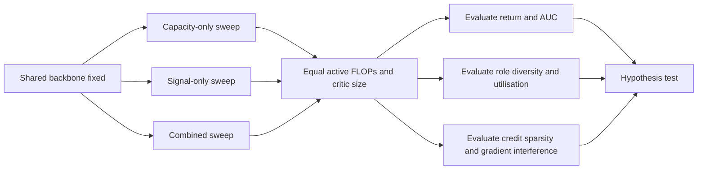

# Role-Specific Training Signals as the Bottleneck in Multi-Role Models

## Executive summary

I interpret your hypothesis as follows: once a shared backbone is already expressive enough to represent multiple useful behaviours, the main remaining bottleneck is often **which gradients each role, agent, or module receives**, not simply **how much extra residual or adapter capacity** it has. In other words, the missing ingredient is better role-conditioned optimisation signals: better credit assignment, better incentives for specialisation, and more stable update schedules. That reading matches the emphasis in your brief. fileciteturn0file0

The recent literature supports a **qualified yes**. In cooperative multi-agent reinforcement learning, improvements often come from making the optimisation signal more role-aware: difference rewards and counterfactual credits reduce variance and make individual contributions more identifiable; partial reward decoupling filters out irrelevant teammates; role-learning methods such as ROMA, RODE, and ACORM explicitly shape latent roles or action subspaces; diversity-oriented methods such as EOI, CDS, DiCo, ADMN, Kaleidoscope, and adaptive parameter-sharing aim to stop shared policies from collapsing into homogeneous behaviour; and sequential trust-region families such as HAPPO/HATRPO, HAML, and A2PO attack the instability caused by simultaneous updates. Across these lines of work, the common theme is not “more parameters by itself”, but rather “more informative, more localised, and more stable training signals”. citeturn33view5turn34view0turn33view3turn16view5turn16view0turn15view3turn16view3turn34view2turn16view2turn34view3turn21view0turn21view6turn34view5turn16view4turn15view1turn18search0turn17search0

The strongest caveat is that **capacity is not irrelevant**. In generic multi-task RL, a 2025 study found that naïvely scaling a simple baseline can beat some more sophisticated architectures, especially by scaling the critic. Sparse conditional-computation results say something similar: extra expert capacity can improve performance, but only if routing is well behaved; otherwise load imbalance, expert collapse, token dropping, or poor fine-tuning dynamics waste that capacity. The right synthesis is therefore: **capacity helps when the model is underfit, but in multi-role settings capacity alone is frequently under-realised unless routing, reward, and update signals tell each role what it is responsible for**. citeturn30search0turn15view8turn15view9turn8search2turn9search0

For the kind of system you are positing—shared backbone plus role-specific residual or LoRA-like branches—the literature suggests three practical priorities. First, improve **role-conditioned advantage estimation** before increasing rank. Second, if you add capacity, pair it with **specialisation pressure** such as MI, contrastive role losses, load-balancing, or mask discrepancy. Third, where role interference is severe, update roles or subteams **sequentially** under a **per-role KL or clipping budget** rather than updating all roles in one unconstrained step. citeturn16view5turn16view3turn21view6turn15view1turn18search0turn17search0turn16view4

## Literature landscape

The clearest recent evidence comes from cooperative MARL, because it makes the “shared backbone versus role-specific signal” trade-off explicit. MAPPO showed that a comparatively simple PPO-based baseline can be highly competitive when implementation details are tuned carefully, which already shifts attention away from novelty in architecture alone and towards the optimisation recipe. PRD and PRD-MAPPO then improved upon shared-reward PPO by learning which teammates are actually relevant to an agent’s future reward, effectively shrinking the credit-assignment set during learning. Difference-reward and Shapley-style methods push the same idea further by explicitly attributing team reward to marginal agent contributions. Sequential trust-region methods such as HAPPO and HATRPO formalised another part of the problem: in cooperative settings, simultaneous updates themselves create non-stationarity, so the order and locality of updates matter. HAML generalised that view, and A2PO sharpened it by showing that update order is not a nuisance detail but a first-class design variable. citeturn36view0turn16view5turn14search2turn33view3turn33view5turn34view0turn15view1turn18search0turn17search0

A second cluster of papers is even closer to your hypothesis because it studies **specialisation under parameter sharing**. ROMA learned stochastic role embeddings with dedicated regularisers so that agents sharing a general framework could still specialise. RODE made role discovery easier by clustering primitive actions by effect and learning a bi-level hierarchy with a low-frequency role selector and role-specific policies on restricted action spaces. ACORM added contrastive and mutual-information objectives for role representation learning and used state-attention over roles inside value decomposition, which is particularly relevant if you want role adapters to receive differentiated gradients from a central critic. Structural Information Principles, EOI, CDS, and Policy Diagnosis all reinforce the same lesson from different angles: good cooperative performance depends on identifiable and behaviourally meaningful role diversity, and the system often benefits when that diversity is measured, regularised, or diagnosed explicitly rather than left to emerge accidentally. citeturn16view0turn15view3turn16view3turn7search0turn34view2turn16view2turn34view4

A third cluster studies **how much sharing to keep**. Adaptive parameter sharing maps agent types into distinct subnetworks within a shared network, gaining behavioural diversity without adding new training parameters. ADMN shares specialised modules but lets each agent learn its own routing over those modules, with an information-theoretic regulariser to keep routings identifiable. Kaleidoscope learns agent-specific masks over common parameters and explicitly encourages discrepancy among those masks. LoRASA is highly relevant to your exact framing: it treats each agent as a specialised task fine-tuned from a shared backbone and appends low-rank agent-specific matrices, reporting gains over shared baselines with lower overhead. Taken together, these papers imply that **the right question is not “shared or separate?” but “what shared structure is retained, and what signal forces useful divergence?”** citeturn34view5turn21view0turn21view6turn16view4

The conditional-computation literature provides an important analogue. Switch Transformer demonstrated that sparse experts can outperform dense models at fixed computation and wall-clock cost, but it also showed that sparse models bring routing instability and require explicit load-balancing. ST-MoE observed that gains from increasing the number of experts diminish once the model becomes extremely sparse. Soft MoE argued that sparse MoEs suffer from token dropping, scaling difficulties, and poor fine-tuning, and Expert Choice routing was motivated precisely by the imbalance created when tokens choose experts independently. For your hypothesis, the important lesson is simple: **extra residual branches or experts are only as useful as the routing and regularisation that gets optimisation signal into them.** citeturn15view8turn15view9turn8search2turn9search0

The strongest counter-evidence to a pure “signals over capacity” view comes from multi-task RL. A 2025 study found that simply scaling a straightforward multi-task baseline can outperform fancier architectures, particularly when critic capacity grows. That matters because it means any decisive experiment on your hypothesis must equalise not just training objectives but also trainable parameters, active parameters, and critic capacity. Otherwise “better role signal” can be confounded with “better optimisation because the critic is larger or less bottlenecked”. citeturn30search0

A compact priority reading list is below.

| Theme | Representative source | Key method | Why it matters here |
|---|---|---|---|
| PPO as strong shared baseline | MAPPO citeturn36view0turn13search0 | PPO with CTDE and careful implementation | Establishes that optimisation details alone can close much of the gap to more complex methods |
| Explicit marginal credit | Difference Rewards PG citeturn33view5 | Difference rewards with policy gradients | Prototype for role-wise or agent-wise advantage shaping |
| Coalition-aware credit | Shapley Counterfactual Credits citeturn34view0 | Monte Carlo Shapley approximations | Strong but expensive form of contribution attribution |
| Relevance-filtered credit | PRD / PRD-MAPPO citeturn33view3turn16view5turn28search0 | Attention-based decoupling of relevant teammates | Very close to role-conditioned credit assignment for shared policies |
| Emergent latent roles | ROMA citeturn16view0turn37search2turn37search0 | Stochastic role embeddings with regularisers | Direct evidence that specialisation can be induced by training signal rather than extra full policies |
| Action-space role decomposition | RODE citeturn15view3turn37search5turn37search1 | Bi-level learning over discovered role action spaces | Shows that lower-frequency role selection can stabilise and simplify multi-agent learning |
| Contrastive role learning | ACORM citeturn16view3turn13search2 | MI and contrastive role losses plus role-attentive value decomposition | Useful template for role-specific critics and adapter training |
| Diversity without task-objective change | DiCo citeturn34view3 | Architectural diversity control to a target value | Clean way to test whether diversity itself helps after controlling for objective |
| Selective sharing | ADMN / Kaleidoscope / AdaPS citeturn21view0turn21view6turn34view5turn20search7 | Routing, masks, or subnetworks within shared policies | Good design space for partial sharing versus full sharing |
| Sequential stable updates | HAPPO/HATRPO, HAML, A2PO citeturn15view1turn18search0turn17search0turn13search5 | Sequential trust-region or mirror-learning updates | Strongest support for “better update signal beats simultaneous noisy updates” |
| Adaptive exploration per agent | ADER citeturn21view5 | Learns agent-specific target entropy | Another example of per-role optimisation signals mattering |
| Capacity with routing caveats | Switch, ST-MoE, Soft MoE, Expert Choice citeturn15view8turn15view9turn8search2turn9search0 | Sparse experts plus routing/load balancing | Best analogy for why capacity alone often under-delivers |

## Mechanism comparison

The table below compares the main mechanisms you asked about. The final column gives **recommended sweep ranges for your experiments**, not a universal literature consensus.

| Mechanism | Representative sources | Theoretical motivation | Main strengths | Main liabilities | Suggested sweep for your study |
|---|---|---|---|---|---|
| Role-wise loss terms via counterfactual or subgroup advantage | Difference rewards, Shapley credits, PRD, PRD-MAPPO citeturn33view5turn34view0turn33view3turn16view5 | Reduce variance by removing reward components unrelated to a role/agent; improve identifiability of contributions | Often the most direct fix for noisy role learning; strong fit to shared-backbone PPO | Needs a stronger critic or relevance model; can be biased if relevance is misestimated | Sweep relevance sparsity threshold, subgroup size cap, and auxiliary critic loss weight; compare soft and hard relevance masks |
| Diversity regularisers on behaviour, roles, masks, or experts | CDS, EOI, ACORM, DiCo, Kaleidoscope citeturn16view2turn34view2turn16view3turn34view3turn21view6 | Prevent collapse to symmetric policies and encourage division of labour, exploration, or identifiability | Cheap to add; often improves exploration and robustness | Easy to over-regularise and force diversity where symmetry is actually optimal | Sweep diversity weight logarithmically; track both performance and a diversity metric to find the turning point |
| Specialisation incentives through partial sharing, masks, modules, or low-rank adapters | AdaPS, ADMN, Kaleidoscope, LoRASA citeturn34view5turn21view0turn21view6turn16view4 | Keep sample efficiency of sharing while allowing controlled behavioural divergence | Good fit for residual-role branches and LoRA-like designs | Can confound “better signal” with “more active parameters” unless active FLOPs are matched | Sweep adapter rank and adapter placement while holding total trainable parameters or active FLOPs fixed |
| Sequential role updates | HAPPO/HATRPO, A2PO citeturn15view1turn17search0 | Reduce non-stationarity by updating one agent/role/subteam at a time | Usually stabilises training when roles interfere strongly | Order sensitivity and higher wall-clock time | Sweep update order, refresh frequency of the critic, and whether order is fixed, random, or relevance-driven |
| Trust-region updates per role | HAPPO/HATRPO, CoPPO, HAML citeturn15view1turn17search3turn18search0 | Bound policy drift per role so local improvements do not destroy coordination | Strongest stability story and cleanest theory | Conservative updates can hide real benefits of better credit signals if budgets are too tight | Sweep per-role KL target or PPO clip ratio separately for shared and role-specific blocks |
| Pure capacity expansion | MAPPO baseline, MTRL scaling, Switch/ST-MoE citeturn36view0turn30search0turn15view8turn15view9 | Extra parameters can reduce underfitting and increase representational capacity | Necessary baseline and sometimes surprisingly strong | Often wastes compute if routing, rewards, or update schedules do not deliver signal into the added capacity | Sweep width, depth, rank, or expert count under iso-FLOP and iso-active-parameter controls |

My synthesis is that the most promising stack for your setting is: **shared backbone + role-specific low-rank branches + attention-filtered role advantages + a light diversity regulariser + sequential role updates with per-role KL control**. That stack combines the strongest empirical signals from PRD-style credit assignment, ACORM/ROMA-style role shaping, LoRASA/Kaleidoscope-style partial sharing, and HAPPO/A2PO-style update stabilisation. citeturn16view5turn16view3turn16view0turn16view4turn21view6turn15view1turn17search0

## Experimental programme

A decisive test of your hypothesis should not ask “does adding a clever role mechanism help?” It should ask: **at matched backbone, matched optimiser, matched active FLOPs, and matched trainable-parameter budget, does improving role-specific training signal beat simply increasing residual capacity?** That design choice is essential because the literature contains both signal-driven wins and scale-driven wins. citeturn30search0turn36view0

The experiment matrix below is designed to answer that question cleanly.

| Experiment | Base model and domains | What is varied | Controls | Expected outcome if your hypothesis is right | Likely failure mode |
|---|---|---|---|---|---|
| Capacity-only sweep | MAPPO or HAPPO with shared backbone plus role-residual branches on SMACv2, MAMuJoCo, and a small MPE/VMAS role toy task | Residual rank or branch width only | Same rollout budget, same critic, no role-specific auxiliaries, equal active FLOPs where possible | Returns improve early if clearly underfit, then plateau; specialisation metrics remain weak or unstable | Misleading win caused by critic undercapacity rather than actor role capacity |
| Credit-only sweep | Same backbone and same role-residual rank | Add role-conditioned subgroup advantage, PRD-style relevance, or difference-reward critic | Keep trainable parameters fixed by removing an equivalent amount of residual capacity | Better data efficiency and lower across-seed variance than capacity-only; stronger contribution identifiability | Relevance model learns spurious sparsity and suppresses useful coordination |
| Diversity-only sweep | Same backbone | Add MI, contrastive, identity, or mask-discrepancy regulariser | No change to reward or update schedule | Better role separation and sometimes better asymptotic return on heterogeneous tasks; weaker or no gain on fully symmetric tasks | Forced diversity hurts tasks where symmetric cooperation is optimal |
| Credit plus diversity | Same backbone | Combine role-wise advantage with diversity regularisation | Same active params as capacity-only | Largest gains on maps with clear division of labour, especially sparse-reward or hard-coordination settings | Hyperparameter interaction makes the system brittle if the diversity pressure is too strong |
| Sequential update study | Best signal-conditioned variant | Simultaneous updates versus sequential role updates with per-role KL or clip budgets | Same total number of gradient steps and policy evaluations | Sequential trust-region updates reduce collapse and improve final performance when role branches interfere | Gains disappear if environment is easy enough that simultaneous updates are already stable |
| Conditional-computation analogue | Sparse MoE or soft modularisation on multi-task RL or a controlled sequence benchmark | Expert count versus router/load-balance/contrastive regularisation | Equal active experts per token and equal optimiser budget | Better routing signal beats simply adding experts once a minimum capacity threshold is reached | Results dominated by implementation details of expert parallelism rather than learning dynamics |

For **small-scale** experiments, I would start with a synthetic role-ground-truth environment plus MPE or VMAS tasks. Build one toy environment where the latent correct decomposition is obvious—for example, healer/tank/DPS or scout/carrier/guard—and log whether the learned role assignments recover that decomposition. This gives you a rare ground-truth test of whether role-specific signals are actually assigning the right gradients rather than just improving the score. Combine that with a small SMAC or MPE benchmark to check that the behaviour transfers beyond the toy setting. citeturn34view4turn34view3

For **medium-scale** experiments, use SMACv2-style tasks with clear tactical differentiation, selected Google Research Football academy scenarios, and MAMuJoCo for continuous control. These are large enough to create role interference and shared-policy collapse, but still manageable on modest compute. The core comparison should be: fixed shared backbone, fixed critic, fixed optimiser, and one of three manipulations—more residual rank, better role credit, or both. MAPPO is the clean baseline, while HAPPO is the clean sequential-update baseline. citeturn36view0turn15view1turn18search1

For **large-scale** experiments, add a conditional-computation analogue. The most honest stress test is to compare: a dense multi-task or multi-role baseline, a larger baseline with more residual/adapter capacity, and a routed model with matched active compute but stronger routing or specialisation losses. This is where MoE-style load balancing, router entropy, or soft modularisation becomes especially informative, because it separates “more capacity” from “better assignment of examples to components”. citeturn15view8turn8search2turn29search0

The key controls are as important as the experiments themselves. Keep the shared backbone identical across conditions. Match **active** parameters, not just total parameters. Report both **actor** and **critic** sizes, because critic scaling can masquerade as better role learning. Use enough seeds to study stability, not just best-seed return. Include a **random-role control**, a **static-handcrafted-role control** when possible, and a **no-residual full-sharing control**. Finally, log whether each added module actually receives gradient and activation mass; otherwise apparent failures of role-specific training are often just dead branches. citeturn30search0turn15view8turn21view6

## Implementation patterns

The most useful implementation pattern is to treat role learning as a **credit-routing problem**. The actor can remain mostly shared, but the critic should expose who mattered to whom, and the optimiser should update role-specific blocks only with the credit they plausibly earned. This is the lesson that most directly connects PRD-style relevance, contrastive role learning, and HAPPO-style local policy stability. citeturn16view5turn16view3turn15view1

### Role-wise credit assignment

```python
# shared actor backbone f_theta
# role-specific low-rank adapters A_r, B_r
# central critic V_phi and relevance model R_phi

for batch in rollouts:
    h = f_theta(batch.obs)                          # shared features
    role_logits = role_head(h)                     # hard or soft roles
    role_probs = softmax(role_logits)

    # adapter mixture: hard role, soft mixture, or Gumbel-softmax
    adapted_h = 0
    for r in roles:
        adapted_h += role_probs[:, r:r+1] * lora_apply(h, A_r, B_r)

    pi = policy_head(h + adapted_h)
    logp, act = sample_actions(pi)

    # central critic returns:
    # 1) state value
    # 2) relevance matrix w_ij indicating how much agent j matters to agent i
    v, rel = V_phi(batch.state, batch.joint_obs, batch.joint_act)

    # compute soft subgroup return/advantage for each agent
    # soft weighting avoids brittle hard thresholds
    adv = []
    for i in agents:
        weighted_reward = 0.0
        for j in agents:
            weighted_reward += rel[i, j] * batch.individual_reward[:, j]
        target_i = discounted_returns(weighted_reward, gamma)
        adv_i = gae(target_i - v[:, i], gamma, lam)
        adv.append(normalise(adv_i))

    # shared update can use team objective
    shared_loss = ppo_clip_loss(pi, act, stack(adv).mean(dim=1))

    # role-specific update uses only the credit routed to that role
    role_loss = 0.0
    for r in roles:
        mask = role_probs[:, r]                    # or hard assignments
        role_adv = masked_mean(stack(adv), mask)
        role_loss += ppo_clip_loss(pi, act, role_adv, weight=mask)

    loss = shared_loss + beta_role * role_loss + value_loss(v, batch)
    optimise(loss)
```

This pattern is closest in spirit to PRD-MAPPO and PRD actor-critic, but it generalises naturally to role-conditioned residual branches. The important design choice is that the role-specific branch is not updated from the undifferentiated team return; it is updated from an advantage that has already been filtered by a relevance or subgroup model. citeturn16view5turn33view3

### Diversity and specialisation regularisers

```python
def diversity_regulariser(role_emb, traj_emb, role_probs, router_probs=None, masks=None):
    loss = 0.0

    # role/trajectory mutual information or contrastive objective
    # positive pairs: same agent/role across nearby timesteps
    # negative pairs: different roles or agents
    loss += lambda_mi * info_nce(role_emb, traj_emb)

    # keep role assignments from collapsing
    # encourages balanced usage of roles over a batch
    mean_role = role_probs.mean(dim=0)
    loss += lambda_balance * kl_div(mean_role, uniform_like(mean_role))

    # encourage behavioural difference only where roles diverge
    # e.g. JS divergence between action distributions of different roles
    for r1 in roles:
        for r2 in roles:
            if r1 < r2:
                loss -= lambda_js * js_divergence(pi_r[r1], pi_r[r2])

    # MoE / router load-balancing
    if router_probs is not None:
        loss += lambda_lb * switch_load_balance(router_probs)

    # mask discrepancy for learnable partial sharing
    if masks is not None:
        loss += lambda_mask * pairwise_mask_discrepancy(masks)

    return loss
```

The practical lesson from the diversity literature is that no single diversity term is dominant. Mutual-information, contrastive, classifier-based, mask-based, and router-balancing objectives are all trying to solve the same failure mode: shared components collapse into one behavioural mode because that is locally easy for optimisation. Your experiments should therefore compare at least one **behaviour-space** regulariser and one **parameter-space** regulariser. citeturn16view2turn34view2turn16view3turn34view3turn21view6turn15view8

### Sequential or trust-region role updates

```python
# sequential role update with per-role KL budget
old_policy = copy_policy(actor)

for epoch in range(num_epochs):
    role_order = choose_order(method="random" or "relevance" or "fixed")
    for r in role_order:
        freeze_all_roles_except(r)

        pi_new = actor(batch.obs)
        adv_r = role_specific_advantage(batch, role=r)

        ratio = exp(logp(pi_new, batch.act) - batch.old_logp)
        unclipped = ratio * adv_r
        clipped = clip(ratio, 1 - eps_r, 1 + eps_r) * adv_r
        policy_loss = -mean(min(unclipped, clipped))

        kl_r = mean(kl_divergence(old_policy.role_dist(r), actor.role_dist(r)))
        trust_penalty = eta_r * max(0.0, kl_r - kl_target_r)

        loss = policy_loss + trust_penalty + value_loss(...)
        optimise(loss)

        # optionally refresh critic or recompute advantages here
        old_policy = copy_policy(actor)
```

This is not identical to HAPPO or HATRPO, but it captures the same principle: when one role moves, the optimisation landscape seen by the other roles changes. Sequential updates make that change explicit instead of hiding it inside one joint gradient step. In a residual-role design, that usually means freezing all role-specific branches except the one being updated, optionally leaving the shared backbone either frozen or on a much tighter KL leash. citeturn15view1turn18search0turn17search0

For implementation anchors, the most useful open-source starting points are the official MAPPO repository `marlbenchmark/on-policy`, the HARL repository for HAPPO/HATRPO, PRD-MAPPO, ACORM, ROMA, RODE, and Kaleidoscope. These are strong baselines both algorithmically and operationally. LoRA’s original package remains the standard low-rank adaptation reference. citeturn13search0turn13search5turn28search0turn13search2turn37search0turn37search1turn20search7turn31search1

## Evaluation and visualisation

Your primary evaluation metric should still be the task metric—win rate, return, success rate, or score—but that is not enough to test your hypothesis. You also need metrics that can reveal **whether the additional role-specific branch actually learned a distinct and useful function**. I recommend reporting five groups of metrics together: task performance; data-efficiency area-under-curve; stability across seeds; specialisation quality; and efficiency cost in active FLOPs, wall-clock time, and memory. The literature gives good templates for specialisation quality in particular: role diversity can be measured from action, trajectory, and contribution perspectives; diversity can be tracked as a target-controlled quantity; and relevance-filtered critics provide a direct way to measure whether the model is allocating credit sparsely or diffusely. citeturn34view4turn34view3turn16view5

The most informative specialisation metrics for your use case are these. First, **between-role policy divergence**, for example average symmetric KL or Jensen–Shannon divergence between action distributions conditioned on the same state. Second, **role–trajectory mutual information** or a contrastive retrieval score between roles and trajectory fragments. Third, **role utilisation balance**, particularly if you use learnable masks or MoE-style routing. Fourth, **contribution sparsity**, meaning how concentrated the relevance matrix or role-wise advantage mass becomes. Fifth, **gradient interference**, measured by cosine similarity between gradients for different roles or by how much a role update changes the losses of other roles. If your hypothesis is right, the winning methods should not only score higher; they should show **cleaner credit sparsity, stronger between-role differentiation, and lower gradient interference** than capacity-only baselines. citeturn16view3turn34view4turn15view8turn16view5turn17search0

The charts I would treat as mandatory are: a return-versus-environment-steps curve with seed bands; a Pareto plot of return versus active parameters or active FLOPs; a plot of return versus diversity score; a heatmap of the learned relevance matrix or mask overlap; and a UMAP or t-SNE projection of role embeddings coloured by role assignment over time. On top of that, for sequential updates, include an order-sensitivity plot, and for MoE-like variants, include per-expert load histograms. These views make it much harder for a capacity-only baseline to hide behind aggregate task score. citeturn34view4turn34view3turn16view0turn16view3turn15view8

A helpful way to structure the experiment logic is the following.



If you want a short list of online figures to keep beside you while implementing, I would choose: the MAPPO ablation plots around implementation choices; the HAPPO/HATRPO sequential-update schematic; the ROMA role-embedding visualisations; the RODE action-space decomposition diagram; the Switch Transformer load-balancing pseudocode; and the DiCo diversity-control curves. Those figures are useful not only for intuition but for deciding what to recreate in your own logs and dashboards. citeturn36view0turn15view1turn16view0turn15view3turn15view8turn34view3

## Open questions and limitations

There is still no large body of papers that isolates **exactly** your proposed comparison—shared PPO-style backbone with role-conditioned low-rank residual branches, holding active compute fixed while varying only residual capacity versus role-specific training signal. The closest direct evidence comes from LoRASA on the capacity side, PRD-MAPPO on the credit-assignment side, and ACORM/ROMA/RODE/Kaleidoscope on the specialisation side. That is enough to justify the hypothesis, but not enough yet to call it settled. citeturn16view4turn16view5turn16view3turn16view0turn15view3turn21view6

The cleanest unresolved empirical question is therefore this: **after matching active parameters, critic size, and optimiser budget, how much of the gain from role-conditioned residual branches comes from extra capacity, and how much comes from the fact that the branch is updated with a better local learning signal?** If I had to bet based on the present literature, I would expect the answer to be task-dependent: capacity matters most in generic multi-task settings or when the critic is underfit, while better role-specific training signals matter most in heterogeneous cooperative settings with sparse or delayed rewards, partial observability, strong non-stationarity, and clear division of labour. citeturn30search0turn15view8turn16view5turn15view1