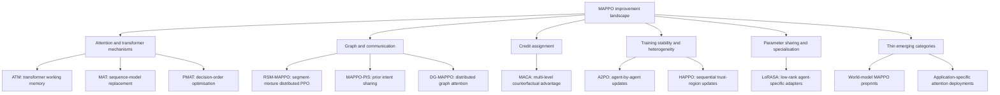
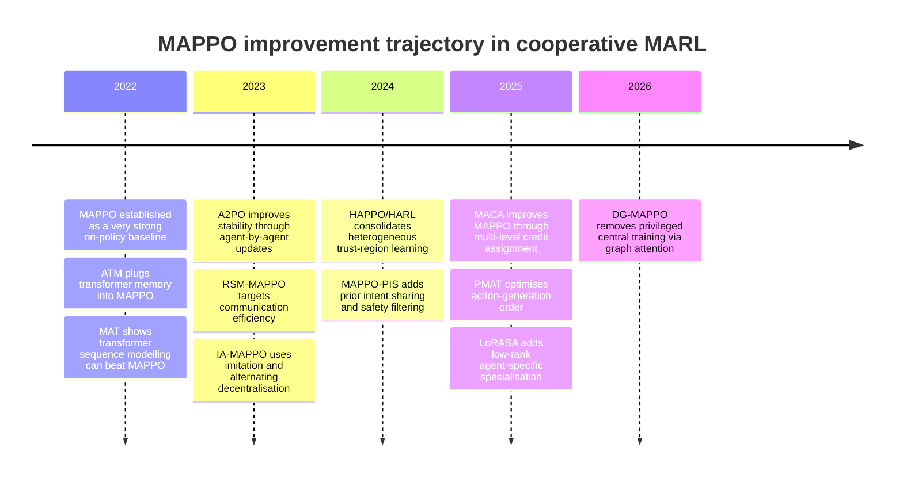

# Improving MAPPO in Cooperative MARL

## Executive summary

Between 2022 and 2026, the strongest improvements around Multi-Agent Proximal Policy Optimisation (MAPPO) in cooperative multi-agent reinforcement learning have not come from “adding attention” in isolation. The more convincing gains come from combining attention or transformer machinery with one of four harder problems: partial observability and memory, explicit credit assignment, communication under limited bandwidth, or specialisation beyond naïve parameter sharing. The highest-confidence direct MAPPO lines in this window are Agent Transformer Memory (ATM), MAPPO-PIS, MACA, LoRASA, and DG-MAPPO; the most influential adjacent on-policy alternatives that repeatedly beat MAPPO are MAT, A2PO, HAPPO, and PMAT. citeturn22view0turn13view1turn6search0turn23view0turn13view3turn12view0turn34view0turn13view2turn24search1

A central empirical lesson is that attention by itself is often not the main source of improvement. MACA is especially informative here: its ablations show that a MAPPO-equivalent variant with a transformer-encoder critic performs only similarly to plain MAPPO, whereas the full multi-level advantage formulation materially improves robustness, sample efficiency, and final win rate on SMAC and SMACv2. Put differently, attention helps most when it is tied to a better inductive bias for *who matters to whom* and *who should receive credit for what*. citeturn25view1turn25view2turn6search0

The transformer-based line itself splits into two rather different families. One family uses transformers as a *drop-in architectural upgrade* for MAPPO-like learners, mostly to improve memory and entity reasoning under partial observability; ATM is the cleanest example, and it improves MAPPO’s learning speed substantially in Level-Based Foraging, including a hard setting where GRU-based and MLP-based MAPPO fail. The second family uses transformers to *replace the MAPPO factorisation of the joint policy* with sequential or autoregressive decision making; MAT and PMAT consistently outperform MAPPO on SMAC, Google Research Football, and Multi-Agent MuJoCo, especially where action dependencies and heterogeneity matter. citeturn37view1turn37view3turn22view0turn12view0turn33view0

Communication-oriented MAPPO improvements are also meaningful, but they fragment into two very different settings. In domain-specific cooperative control, MAPPO-PIS shows that explicit future-intent sharing paired with a safety filter can improve reward and safety over vanilla MAPPO in mixed-traffic merging. In more general cooperative MARL, DG-MAPPO is the more consequential result: it removes the centralised critic entirely and replaces privileged state access with distributed graph attention and multi-hop communication, yet still matches or exceeds strong CTDE baselines on multiple SMAC tasks and stays competitive on Google Research Football and Multi-Agent MuJoCo. citeturn28view2turn28view1turn31search2turn26view0turn27view1turn27view2

The practical upshot for researchers is straightforward. If your bottleneck is partial observability, use a transformer memory module; if it is heterogeneity or non-stationarity, use sequential-update methods such as A2PO or HAPPO; if it is credit assignment, MACA is the strongest MAPPO-native result in this window; if it is scalability with limited privileged information, DG-MAPPO is the most interesting emerging direction; and if it is the tension between coordination and specialisation, LoRASA is a promising low-overhead option on top of MAPPO. citeturn22view0turn34view0turn13view2turn6search0turn13view3turn23view0

## Scope and taxonomy

This report includes only papers from 2022–2026 and prioritises primary sources: conference or journal proceedings, PMLR, NeurIPS/OpenReview pages, JMLR, AAMAS, and arXiv. I treat the literature in two tiers. The first tier contains **direct MAPPO modifications or plug-ins**: ATM, RSM-MAPPO, IA-MAPPO, MAPPO-PIS, MACA, LoRASA, and DG-MAPPO. The second tier contains **adjacent on-policy mechanisms that repeatedly outperform MAPPO and function as reference alternatives**: MAT, A2PO, HAPPO, and PMAT. This matters because the direct “attention-enhanced MAPPO” literature is narrower than the broader space of mechanisms that improve on MAPPO in cooperative MARL. citeturn22view0turn13view0turn12view3turn13view1turn6search0turn23view0turn13view3turn12view0turn34view0turn13view2turn24search1

The mechanisms cluster into six practical categories. **Attention/transformer-based mechanisms** improve entity reasoning, memory, or sequential action generation through self-attention and encoder-decoder policies. **Graph/GNN communication mechanisms** replace or supplement privileged global state with learned message passing. **Communication and intent-sharing mechanisms** expose future plans or policy components across agents to improve coordination under bandwidth or observability limits. **Credit-assignment methods** redesign the advantage estimator rather than the network alone. **Training-stability methods** tackle simultaneous-update non-stationarity via sequential trust-region or agent-by-agent updates. **Parameter-sharing/specialisation methods** retain a shared policy backbone but introduce lightweight agent-specific adaptation. Direct MAPPO work on world models, causal credit assignment, regularisation, and auxiliary losses exists only thinly in this window; the clearest general-purpose signals I found there are still emerging preprints rather than mature benchmark-backed MAPPO lines. citeturn22view0turn26view0turn13view1turn13view0turn6search0turn34view0turn13view2turn23view0turn11academia1

The empirical landscape also has a benchmark pattern. General-purpose papers overwhelmingly use SMAC or SMACv2, Google Research Football, Multi-Agent MuJoCo, and sometimes MPE or Level-Based Foraging. Domain papers often report in-domain metrics that matter operationally but are not directly comparable to the benchmark stack: collision rate, average speed, throughput-cost trade-off, or latency restoration time. That makes broad scientific comparison strongest for MACA, MAT, PMAT, A2PO, HAPPO, and DG-MAPPO, and weaker for domain-specific MAPPO variants such as MAPPO-PIS or RSM-MAPPO. citeturn25view1turn12view0turn33view0turn34view0turn13view2turn27view1turn28view2turn35academia2

The taxonomy below summarises the field as it appears from the 2022–2026 corpus reviewed here.

## Comparative table

The table below compares the highest-confidence papers reviewed here. “Performance vs MAPPO baseline” is stated conservatively; where the accessible source text did not expose exact aggregate gains, I mark the detail as unspecified.

| Paper | Year | Mechanism | Modification to MAPPO | Benchmarks | Performance vs MAPPO baseline | Code available? |
|---|---:|---|---|---|---|---|
| ATM, *Transformer-based Working Memory for Multiagent Reinforcement Learning with Action Parsing*. citeturn22view0turn37view1 | 2022 | Transformer memory + action parsing | Plug-in module for MAPPO/MAA2C under partial observability | SMAC; Level-Based Foraging. citeturn22view0turn37view2 | ATM-MAPPO learns faster than GRU/MLP MAPPO; on LBF 15x15\_4p\_6f, GRU- and MLP-MAPPO fail while ATM-MAPPO learns from scratch. citeturn37view1turn37view3 | Unspecified. citeturn22view0 |
| MAT, *Multi-Agent Reinforcement Learning is a Sequence Modeling Problem*. citeturn12view0 | 2022 | Encoder-decoder transformer; sequential action generation | Replaces MAPPO-style joint action modelling with transformer sequence modelling | SMAC; Multi-Agent MuJoCo; Dexterous Hands; Google Research Football. citeturn12view0 | Superior performance and data efficiency to MAPPO and HAPPO across the reported benchmarks. citeturn12view0 | Yes. citeturn32search2 |
| A2PO, *Order Matters: Agent-by-agent Policy Optimization*. citeturn34view0turn34view1 | 2023 | Sequential policy updates; order-aware trust-region training | Adjacent on-policy alternative to simultaneous MAPPO updates | StarCraft II; Multi-Agent MuJoCo; MPE; Google Research Football full game. citeturn34view0turn34view1 | Consistently outperforms strong baselines, including MAPPO. citeturn34view0turn34view1 | Community implementation listed; official code unspecified in source reviewed. citeturn34view0 |
| HARL / HAPPO, *Heterogeneous-Agent Reinforcement Learning*. citeturn13view2turn14search13 | 2024 | Sequential update scheme; heterogeneous trust-region learning | Generalises beyond shared-parameter MAPPO; HAPPO is the PPO-style instance | Six challenging cooperative benchmarks; exact list not enumerated in abstract snippet reviewed here. citeturn13view2 | Superior effectiveness and stability to MAPPO and QMIX for heterogeneous-agent coordination. citeturn13view2 | Yes. citeturn14search16 |
| RSM-MAPPO, *Communication-Efficient Cooperative Multi-Agent PPO via Regulated Segment Mixture in Internet of Vehicles*. citeturn13view0turn35search1 | 2023 | Distributed policy-segment exchange; replica regulation | Communication-efficient distributed MAPPO/PPO variant | Mixed-autonomy traffic control in IoV. citeturn13view0turn35academia2 | Effective under reduced communication cost; exact delta to vanilla MAPPO unspecified in the accessible abstract. citeturn13view0turn35academia2 | Unspecified. citeturn13view0 |
| IA-MAPPO, *Imitation Learning based Alternative Multi-Agent Proximal Policy Optimization for Well-Formed Swarm-Oriented Pursuit Avoidance*. citeturn12view3 | 2023 | Imitation learning + alternating training | Distils a centralised MAPPO executor into more decentralised controllers | Well-formed swarm pursuit-avoidance simulations. citeturn12view3 | Comparable to a centralised solution with substantially reduced communication overhead; exact aggregate gain unspecified. citeturn12view3 | Unspecified. citeturn12view3 |
| MAPPO-PIS, *MAPPO-PIS: A Multi-Agent Proximal Policy Optimization Method with Prior Intent Sharing for CAVs’ Cooperative Decision-Making*. citeturn13view1turn28view2 | 2024 | Prior intent sharing + safety enhancement | Adds an intention generator and safety-enhanced module to MAPPO | Highway merging with homogeneous and heterogeneous traffic. citeturn13view1turn28view2 | Easy mode: reward 73.45 vs 44.03 for MAPPO; hard mode: reward 33.27 vs -36.58, lower collision in hard mode 0.01 vs 0.03. citeturn28view2 | Yes. citeturn31search2 |
| MACA, *Multi-level Advantage Credit Assignment for Cooperative Multi-Agent Reinforcement Learning*. citeturn6search0turn6search13 | 2025 | Explicit multi-level counterfactual credit assignment; attention for correlated-agent sets | Keeps the MAPPO backbone but replaces the advantage mechanism and critic relations | SMAC; SMACv2; MPE. citeturn25view1turn25view2 | Significantly stronger overall than MAPPO/HAPPO/IPPO/PPO-Mix on SMACv1&v2; faster learning on SMACv2. citeturn25view1turn25view2 | Yes. citeturn6search11 |
| PMAT, *PMAT: Optimizing Action Generation Order in Multi-Agent Reinforcement Learning*. citeturn24search1turn24search4turn33view0 | 2025 | Transformer + Plackett-Luce decision-order optimisation | Extends MAT; adjacent alternative that improves upon MAPPO | SMAC; Google Research Football; Multi-Agent MuJoCo. citeturn33view0 | On SMAC: 99.4% vs 75.0% MAPPO on 10m vs 11m; 85.0% vs 58.8% on MMM2. On GRF counterattack easy: 0.899 vs 0.588. citeturn33view0 | Yes. citeturn30search1 |
| LoRASA, *Low-Rank Agent-Specific Adaptation for Multi-Agent Policy Learning*. citeturn23view0turn30search4 | 2025 | Low-rank agent-specific adapters on shared backbones | Applied atop MAPPO and A2PO to balance sharing and specialisation | SMAC; Multi-Agent MuJoCo. citeturn23view0turn29view0 | Frequently matches or outperforms parameter-sharing baselines and often approaches or exceeds heavier baselines while reducing memory/compute; exact summary deltas vary by scenario. citeturn27view3turn29view0 | Unspecified in sources reviewed. citeturn23view0 |
| DG-MAPPO, *Multi-Agent Deep Reinforcement Learning Under Constrained Communications*. citeturn13view3turn26view0 | 2026 | Distributed graph attention + consensus regularisation + multi-hop communication | Removes centralised critics and privileged state from MAPPO entirely | SMAC; Google Research Football; Multi-Agent MuJoCo. citeturn26view0 | Beats MAPPO on many SMAC tasks, e.g. MMM 100.0 vs 95.6, MMM2 98.9 vs 81.8, 6h vs 8z 95.0 vs 88.4; trails MAPPO on 25m. citeturn27view1turn27view2 | Unspecified. citeturn13view3 |

## Paper-by-paper analysis

**Baseline context: Chao Yu, Akash Velu, Eugene Vinitsky, Jiaxuan Gao, Yu Wang, Alexandre Bayen, and Yi Wu, “The Surprising Effectiveness of PPO in Cooperative Multi-Agent Games,” NeurIPS 2022.** This is the benchmark-setting paper for modern MAPPO. It shows that PPO with a centralised value function is unexpectedly strong across MPE, SMAC, Google Research Football, and Hanabi, often matching or beating competitive off-policy baselines in both final performance and sample efficiency, and it also released the canonical on-policy codebase that much later work builds on. Its importance in this literature is not that it already solves MAPPO’s limitations, but that it establishes a surprisingly hard-to-beat baseline, which is why later methods need broader benchmark evidence and careful ablations to claim progress. The main limitation, from the perspective of this review, is that it does not add new coordination structure beyond CTDE and therefore leaves memory, heterogeneity, communication cost, and credit assignment largely unaddressed. citeturn9search5turn9search1turn9search2

**Yaodong Yang, Guangyong Chen, Weixun Wang, Xiaotian Hao, Jianye Hao, and Pheng-Ann Heng, “Transformer-based Working Memory for Multiagent Reinforcement Learning with Action Parsing,” NeurIPS 2022.** ATM is one of the cleanest examples of a transformer used as a **MAPPO plug-in** rather than a replacement. It adds a fixed-capacity transformer memory and binds actions to relevant entities through action parsing, which gives the network an entity-aware and temporally persistent representation under partial observability. The key experiments are on SMAC and Level-Based Foraging. In LBF, ATM plugged into MAPPO and MAA2C improves learning speed by a large margin over GRU and MLP baselines; notably, GRU-based and MLP-based MAPPO fail on the hard 15x15\_4p\_6f task, whereas ATM-MAPPO learns it. The strength of ATM is that it is architecturally simple and directly reusable in on-policy pipelines. Its main limitation is that the accessible source text does not provide a compact cross-benchmark numerical summary and does not isolate exactly how much gain comes from memory versus action semantics. Relative to MAT and PMAT, ATM is less radical: it still keeps the MAPPO-style optimisation scaffold. citeturn22view0turn37view1turn37view2turn37view3

**Muning Wen, Jakub Grudzien Kuba, Runji Lin, Weinan Zhang, Ying Wen, Jun Wang, and Yaodong Yang, “Multi-Agent Reinforcement Learning is a Sequence Modeling Problem,” arXiv 2022.** MAT is not a MAPPO variant in the narrow sense, but it is indispensable because it reframes cooperative MARL as sequence modelling and shows that an online autoregressive transformer can outperform MAPPO and HAPPO on SMAC, Multi-Agent MuJoCo, Dexterous Hands, and Google Research Football. Architecturally, MAT uses an encoder-decoder transformer and a multi-agent advantage decomposition theorem to turn joint policy search into sequential action generation with linear-time complexity in the agent dimension. Empirically, the paper’s headline claim is better performance and data efficiency than MAPPO and HAPPO, along with few-shot generalisation to changed team sizes. The main strength is representational power over inter-agent action dependencies; the main limitation, for a MAPPO-focused practitioner, is that MAT is a more substantial replacement than a drop-in improvement. It is best viewed as the transformer reference point against which later direct MAPPO upgrades should be judged. citeturn12view0turn32search2

**Xihuai Wang, Zheng Tian, Ziyu Wan, Ying Wen, Jun Wang, and Weinan Zhang, “Order Matters: Agent-by-agent Policy Optimization,” ICLR 2023.** A2PO is the clearest training-stability alternative to simultaneous MAPPO updates. It retains an on-policy trust-region flavour but updates agents sequentially, improving sample efficiency and restoring per-agent monotonic-improvement guarantees that degrade under simultaneous optimisation. The official sources report evaluation on StarCraft II, Multi-Agent MuJoCo, MPE, and Google Research Football full-game scenarios, with the headline result that A2PO consistently outperforms strong baselines. For this review, the important conceptual advance is that not all MAPPO improvements are architectural: reordering the *update structure* can itself be decisive. The strength is theoretical clarity on non-stationarity and update order. The limitation is practical complexity; sequential updates add implementation overhead and can be slower or more cumbersome than plain MAPPO in large systems. Relative to HAPPO, A2PO is the broader “agent-by-agent order matters” story; relative to PMAT, it targets optimiser order rather than action-generation order. citeturn34view0turn34view1

**Yifan Zhong, Jakub Grudzien Kuba, Xidong Feng, Siyi Hu, Jiaming Ji, and Yaodong Yang, “Heterogeneous-Agent Reinforcement Learning,” JMLR 2024.** HARL consolidates the theory behind heterogeneous-agent trust-region methods, including HAPPO, and is highly relevant because vanilla MAPPO’s heavy reliance on parameter sharing is a frequent source of instability and representational mismatch in heterogeneous settings. The paper introduces a multi-agent advantage decomposition lemma, a sequential update scheme, and the HAML framework, then derives HAPPO and related algorithms with monotonic improvement and convergence guarantees. The authors report superior effectiveness and stability over MAPPO and QMIX across six challenging benchmarks, although the accessible abstract snippet does not enumerate the exact six. The strength here is not attention but *correctness under heterogeneity*. The main limitation is that, compared with architecture-based upgrades such as ATM or DG-MAPPO, HAPPO does not itself solve memory or communication bottlenecks. Relative to LoRASA, HAPPO addresses heterogeneity at the optimiser level rather than through parameter-efficient specialisation layers. citeturn13view2turn14search13turn14search16

**Xiaoxue Yu, Rongpeng Li, Fei Wang, Chenghui Peng, Chengchao Liang, Zhifeng Zhao, and Honggang Zhang, “Communication-Efficient Cooperative Multi-Agent PPO via Regulated Segment Mixture in Internet of Vehicles,” GLOBECOM 2023 / arXiv 2023.** RSM-MAPPO targets a different frontier from most benchmark papers: reducing communication overhead in a fully distributed architecture. The method mixes received neighbouring policy segments into multiple replicas and then uses a theory-guided selection metric to keep contributive replicas, with the goal of maintaining policy improvement under bandwidth constraints. The reported empirical setting is mixed-autonomy traffic control in the Internet of Vehicles, where the authors say the method is effective. Its clear strength is communication efficiency; its main limitation for general MARL science is benchmark narrowness and a lack of accessible, benchmark-standard summary metrics against vanilla MAPPO in the abstracted source text I reviewed. Still, it is one of the few explicit attempts in this period to adapt a MAPPO-style method to realistic distributed communication limits rather than assuming free global information. citeturn13view0turn35search1turn35academia2

**Sizhao Li, Yuming Xiang, Rongpeng Li, Zhifeng Zhao, and Honggang Zhang, “Imitation Learning based Alternative Multi-Agent Proximal Policy Optimization for Well-Formed Swarm-Oriented Pursuit Avoidance,” IEEE ICCC 2023 / arXiv 2023.** IA-MAPPO begins with a centralised MAPPO executor capable of switching across formations and then uses imitation learning plus alternating training to decentralise the controller, reduce communication cost, and recover performance lost in decentralisation. The reported result is performance comparable to a centralised solution with substantial communication reduction in swarm pursuit-avoidance simulations. This paper is useful because it shows a route to improving MAPPO without changing the core optimiser or adding attention: distil the centralised coordinator into a cheaper decentralised controller and compensate with alternating re-training. The key drawback is that exact benchmark-standard metrics and broad benchmark coverage are not exposed in the accessible abstract, so it is best treated as an application-specific but relevant communication-and-decentralisation mechanism rather than a general benchmark leader. citeturn12view3

**Yicheng Guo, Jiaqi Liu, Rongjie Yu, Peng Hang, and Jian Sun, “MAPPO-PIS: A Multi-Agent Proximal Policy Optimization Method with Prior Intent Sharing for CAVs’ Cooperative Decision-Making,” arXiv 2024.** MAPPO-PIS is one of the clearest direct MAPPO modifications in the application literature. It adds two modules: an Intention Generator Module that shares future trajectory intentions and a Safety Enhanced Module that filters unsafe exploratory decisions. On merging scenarios in mixed human–autonomous traffic, it beats vanilla MAPPO and other MARL baselines on evaluation reward, safety, and stability. The accessible tables are unusually concrete: in easy mode, MAPPO-PIS reaches reward 73.45 versus 44.03 for MAPPO, with equal collision rate 0.00; in hard mode, it reaches reward 33.27 versus -36.58 for MAPPO and a lower collision rate of 0.01 versus 0.03. In heterogeneous-vehicle tests it also beats MAPPO on reward and collision rate. The strength is practical coordination through explicit future-intent sharing; the limitation is domain specificity and mixed comparability with standard MARL benchmarks. Relative to DG-MAPPO, MAPPO-PIS injects structured semantic communication; DG-MAPPO instead learns graph communication end-to-end. citeturn13view1turn28view0turn28view1turn28view2turn31search2

**Xutong Zhao and Yaqi Xie, “Multi-level Advantage Credit Assignment for Cooperative Multi-Agent Reinforcement Learning,” AISTATS 2025.** MACA is, in my judgement, the single most informative direct improvement to the MAPPO framework in this period, because it answers a foundational question: how much of MAPPO’s weakness is really an advantage-estimation problem? MACA formalises multiple levels of cooperation and constructs a multi-level counterfactual advantage combining individual, joint, and correlated-action credits. Attention is used to identify correlated agent sets, but the paper’s own ablations show that this is not the whole story: the MAPPO-equivalent variant with a transformer-encoder critic, MACA-Jnt, performs similarly to MAPPO, while the full multi-level advantage materially improves final performance and sample efficiency, especially on SMACv2. The paper evaluates on SMAC, SMACv2, and MPE, with repeated-seed evaluation and significance testing, and reports that MACA is significantly stronger overall than MAPPO/HAPPO/IPPO/PPO-Mix on the more challenging settings. Its strength is the combination of explicit credit assignment, strong benchmarking, and a crucial negative result about “attention-only” upgrades. Its limitation is complexity in explanation and optimisation, including the learned weighting of multiple credit terms. citeturn6search0turn25view1turn25view2turn25view3turn6search11

**Kun Hu, Muning Wen, Xihuai Wang, Shao Zhang, Yiwei Shi, Minne Li, Minglong Li, and Ying Wen, “PMAT: Optimizing Action Generation Order in Multi-Agent Reinforcement Learning,” AAMAS 2025.** PMAT extends MAT with Action Generation via Plackett-Luce Sampling, which learns a sequential decision order as a ranking problem and gives higher priority to agents whose local observations are most informative for joint advantage. This is an elegant mechanism because it operationalises a common intuition in cooperation: not every agent should “speak” or decide first at every timestep. The empirical results are strong and unusually specific. On SMAC, PMAT reaches 99.4% win rate on 10m vs 11m versus 75.0% for MAPPO and 85.0% on MMM2 versus 58.8% for MAPPO. On Google Research Football, it reaches 0.899 average episode score on academy counterattack easy versus 0.588 for MAPPO. It also beats MAPPO and HAPPO on the Multi-Agent MuJoCo Ant setups. The strengths are coordination efficiency, stability, and explicit management of action dependencies. The limitation, again, is that PMAT is an adjacent replacement rather than a drop-in MAPPO patch. Relative to A2PO, PMAT optimises **decision** order, not **training update** order. citeturn24search1turn24search4turn24search7turn33view0turn30search1

**Beining Zhang, Aditya Kapoor, and Mingfei Sun, “Low-Rank Agent-Specific Adaptation for Multi-Agent Policy Learning,” arXiv 2025; author page lists DAI 2025.** LoRASA addresses a chronic MAPPO issue: parameter sharing is efficient, but it suppresses individual specialisation. The idea is to keep a shared backbone and add small low-rank adapter matrices for each agent, treating agent-specific policies as lightweight fine-tuning tasks. The paper evaluates LoRASA on top of MAPPO and A2PO on SMAC and Multi-Agent MuJoCo. The accessible synthesis in the source says LoRASA frequently outperforms naïve parameter sharing, often matches or surpasses heavier baselines, and substantially reduces resource overhead compared with non-shared policies. The ablations are practically valuable: LoRA helps most when introduced after the shared policy has learned a strong common foundation but before or around convergence, and moderate ranks adapted across all layers work best. The main strength is its low engineering cost relative to fully separate actor networks. The limitation is that exact aggregate gains are scenario-dependent and the accessible text does not supply a compact numerical summary across all tasks. Relative to HAPPO, LoRASA is a parameterisation trick; relative to MACA, it helps specialisation rather than credit assignment. citeturn23view0turn27view3turn29view0turn29view2turn30search4

**Shahil Shaik, Jonathon M. Smereka, and Yue Wang, “Multi-Agent Deep Reinforcement Learning Under Constrained Communications,” arXiv 2026.** DG-MAPPO is the most interesting 2026 result because it asks whether MAPPO can survive without the privileged global state assumptions of CTDE. The answer in this paper is “often yes,” if agents can build a global approximation through multi-hop distributed graph attention. D-GAT performs local message passing with attention and consensus-style alignment, and DG-MAPPO then uses those inferred representations in both the actor and per-agent value functions. The benchmarks are SMAC, Google Research Football, and Multi-Agent MuJoCo. The accessible SMAC table is strong: DG-MAPPO beats vanilla MAPPO on 8m, MMM, 5m vs 6m, 8m vs 9m, 10m vs 11m, MMM2, 6h vs 8z, and 3s5z vs 3s6z, though it trails MAPPO on 25m. The paper also reports competitive Google Research Football and MuJoCo curves under sparse communication, and shows that only a few message-passing hops are often enough. The strengths are scalability, robustness at test time, and a clean answer to the train–test mismatch of CTDE. The limitation is recency: this is still a preprint, and code availability was not specified in the sources I reviewed. citeturn13view3turn26view0turn27view1turn27view2

## Second sweep and synthesis

My second sweep materially changed the landscape in two ways. First, it added several important 2025–2026 papers that broaden the field beyond “attention on MAPPO”: PMAT contributed **decision-order optimisation**, LoRASA contributed **parameter-efficient specialisation on top of MAPPO**, and DG-MAPPO contributed **fully distributed graph-attentional coordination without privileged central state**. Those additions make the post-2024 picture meaningfully richer than a simple transformer-versus-MLP story. citeturn24search1turn33view0turn23view0turn27view3turn13view3turn26view0

Second, the sweep strengthened a more subtle conclusion: direct gains over MAPPO rarely come from replacing the critic with a more expressive attention block alone. MACA’s ablations are the clearest evidence for this, but the broader pattern agrees. The methods that move the frontier are the ones that redesign **what information is exchanged**, **how credit is assigned**, **who updates first**, or **how agents specialise**. This is why PMAT, A2PO, MACA, and DG-MAPPO look more consequential than a generic “attention-augmented MAPPO critic” in the reviewed window. citeturn25view2turn33view0turn34view0turn26view0

There were also a few emerging or application-specific additions in the second sweep that are worth noting but should be regarded as lower-confidence evidence for general cooperative MARL. One is an attention-based multimodal world-model preprint that proposes training cooperative policies such as MAPPO in latent imagination space and claims large sample-efficiency gains, but the evidence is currently tied to a new benchmark family rather than the standard SMAC/GRF/MAMuJoCo stack. Another is AE-MAPPO in 6G RAN slicing, which uses multiple specialised attention modules and reports strong operational outcomes, but it is highly domain-specific and not a general cooperative MARL benchmark paper. These are promising signals for the memory/world-model and interpretability categories, but they are not yet the strongest basis for general conclusions about MAPPO improvement. citeturn11academia1turn10academia3

The timeline below captures the highest-confidence trajectory.

## Practical recommendations and open gaps

For implementation, the most defensible starting point is still the official MAPPO-style on-policy stack introduced by Yu et al., because many later papers build on that training recipe and because the baseline itself is unusually strong. From there, the choice of mechanism should follow the bottleneck you actually face rather than a blanket preference for attention. citeturn9search1turn9search2

If your bottleneck is **partial observability or entity-rich observations**, an ATM-style transformer memory is the most direct MAPPO upgrade reviewed here. If your bottleneck is **heterogeneity or simultaneous-update instability**, A2PO or HAPPO-style sequential trust-region updates are better bets than architectural tweaks. If your bottleneck is **credit assignment under tightly coupled rewards**, MACA is the strongest evidence-backed MAPPO-native advance; its ablations specifically argue against expecting large gains from critic attention alone. If your bottleneck is **limited communication or no privileged state**, DG-MAPPO is the most interesting general preprint and MAPPO-PIS/RSM-MAPPO are good application-specific patterns. If your bottleneck is **specialisation under tight memory budgets**, LoRASA is more attractive than abandoning parameter sharing altogether. citeturn22view0turn34view0turn13view2turn25view2turn26view0turn28view2turn13view0turn23view0

Methodologically, future implementations should report more than final score. The reviewed literature suggests that the most informative evaluation bundle for MAPPO variants is: final win rate or return, sample-efficiency trajectory or area-under-curve, variance across seeds, communication cost or message count where relevant, wall-clock cost, parameter count, and generalisation under changed team size, sparse graphs, or heterogeneous roles. DG-MAPPO, PMAT, LoRASA, and MAPPO-PIS each point to one of these dimensions, but very few papers report all of them together. citeturn27view2turn33view0turn27view3turn28view1

The main open gaps are clear. **Direct MAPPO world-model work remains immature** in this window; the most promising signal is still preprint-stage. **Explicit causal or counterfactual credit assignment for MAPPO is still sparse**, with MACA the strongest current result rather than the start of a crowded line. **Benchmark discipline is uneven**: many papers still rely on narrow application settings or a small subset of standard tasks. **Attention ablations are often weak**: the field still needs more papers that isolate actor attention, critic attention, memory, message routing, and credit assignment cleanly enough to say what is actually doing the work. Finally, **code availability is inconsistent**, which makes reproduction harder exactly where the mechanisms become most complex. citeturn11academia1turn25view2turn28view2turn13view0turn13view3

Taken together, the best current reading is this: in cooperative MARL, MAPPO is improved most reliably not by making its networks merely “more transformer-like,” but by using attention or related mechanisms to impose the *right structure* on memory, communication, decision order, and credit assignment. That is the strongest cross-paper pattern in the 2022–2026 literature reviewed here. citeturn25view2turn37view1turn33view0turn26view0turn23view0